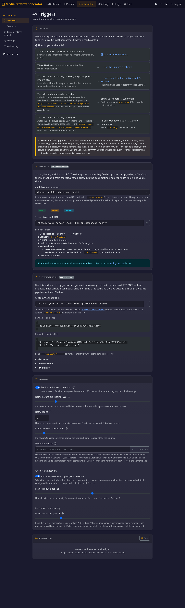

<!-- PROJECT SHIELDS -->
<div align="center">

[![Contributors][contributors-shield]][contributors-url]
[![Forks][forks-shield]][forks-url]
[![Stargazers][stars-shield]][stars-url]
[![Issues][issues-shield]][issues-url]
[![MIT License][license-shield]][license-url]
[![Docker Pulls][docker-shield]][docker-url]
[![codecov][codecov-shield]][codecov-url]
[![AI-Assisted][ai-shield]][ai-url]

</div>

<!-- PROJECT LOGO -->
<div align="center">
  

  <h1 align="center">Media Preview Generator</h1>

  <p align="center">
    GPU-accelerated video preview thumbnail generation for <strong>Plex, Emby, and Jellyfin</strong>
    <br />
    <a href="docs/README.md"><strong>Explore the docs</strong></a>
    <br />
    <br />
    <a href="#quick-start">Quick Start</a>
    &middot;
    <a href="https://github.com/stevezau/media_preview_generator/issues/new?labels=bug">Report Bug</a>
    &middot;
    <a href="https://github.com/stevezau/media_preview_generator/issues/new?labels=enhancement">Request Feature</a>
  </p>
</div>

---

## About

Generates video preview thumbnails for **Plex, Emby, and Jellyfin**. These are the small images you see when scrubbing through videos in any of those servers.

**The Problem:** Built-in preview generation has gaps depending on the server you run:

- **Plex** generates thumbnails single-threaded on the CPU (no GPU support).
- **Emby** has no GPU support for thumbnail generation at all.
- **Jellyfin** does support hardware-accelerated trickplay, but it shares CPU/GPU with playback — and on a busy server that's resources you'd rather give to the player.

**The Solution:** This tool runs preview generation **off the media server** on a machine of your choosing, uses every GPU it finds, and processes files in parallel. When two or more servers contain the same file, FFmpeg runs only once — the result is then written out in each server's own expected format, automatically.

> [!NOTE]
> This project was originally hand-written. Recent development is AI-assisted (Cursor + Claude). All changes are reviewed and tested.

---

## Features

**One FFmpeg pass, every server.** Point it at Plex, Emby, Jellyfin — any mix,
any number — and a single generation run writes the right output format to each
(Plex BIF bundle, Emby sidecar BIF, Jellyfin trickplay tiles). See the
[multi-server guide](docs/multi-server.md) for how the dispatcher routes one
file to every server that owns it.

**Automation that just works.** Radarr / Sonarr / Tdarr / FileFlows webhooks,
Plex direct (Plex Pass), Recently Added polling, cron & interval schedules —
all share one universal inbound URL with vendor auto-detection. A 5-step
backoff retry (30 s → 2 m → 5 m → 15 m → 60 m) handles files your server
hasn't indexed yet. Source-aware dedup re-runs automatically when a file is
swapped (e.g. a Sonarr/Radarr quality upgrade) and skips when nothing changed.

**Hardware you already have.** NVIDIA, AMD, Intel — per-GPU worker counts and
FFmpeg threads, automatic in-place CPU retry if a codec fails on the GPU, and
HDR / Dolby Vision tone mapping (including Profile 5 via libplacebo). A
**Previews Readiness** panel on each server audits every flag that affects
whether your previews actually show up, with one-click toggles and typed
confirmation for destructive changes.

---

## Screenshots

<table><tr>
<td><a href="docs/images/home.png"></a></td>
<td><a href="docs/images/servers.png"></a></td>
<td><a href="docs/images/settings.png"></a></td>
<td><a href="docs/images/automation.png"></a></td>
</tr></table>

---

## Quick Start

### Docker (Recommended)

```bash
docker run -d \
  --name media-preview-generator \
  --restart unless-stopped \
  -p 8080:8080 \
  --device /dev/dri:/dev/dri \
  -e PUID=1000 \
  -e PGID=1000 \
  -v /path/to/media:/media:ro \
  -v /path/to/plex/config:/plex:rw \
  -v /path/to/app/config:/config:rw \
  -v /etc/localtime:/etc/localtime:ro \
  stevezzau/media_preview_generator:latest
```

Replace `/path/to/media`, `/path/to/plex/config`, and `/path/to/app/config` with your actual paths.

> **Timezone:** The `/etc/localtime` mount ensures log timestamps and scheduled jobs use your local time. Alternatively, use `-e TZ=America/New_York` (replace with your [timezone](https://en.wikipedia.org/wiki/List_of_tz_database_time_zones)).

Then open `http://YOUR_IP:8080`, retrieve the authentication token from container logs, and complete the setup wizard.

For Docker Compose, Unraid, and GPU-specific setup:

- [Getting Started](docs/getting-started.md)
- [Configuration & API Reference](docs/reference.md)

---

## Installation

| Method | Best For | Guide |
|--------|----------|-------|
| **Docker** | Most users, easy GPU setup | [Getting Started](docs/getting-started.md) |
| **Docker Compose** | Managed deployments | [docker-compose.example.yml](docker-compose.example.yml) |
| **Unraid** | Unraid servers | [Getting Started — Unraid](docs/getting-started.md#unraid) |

- **Web UI only:** The Docker image runs the web interface. There is no CLI; all configuration and job management is done via the web UI.
- **PyPI:** The package is no longer published on PyPI; use Docker or install from source.

> [!IMPORTANT]
> The Docker Hub image is published as `stevezzau/media_preview_generator` — the **double `z`** is the author's Docker Hub username (not a typo).
> [stevezzau/media_preview_generator on Docker Hub](https://hub.docker.com/r/stevezzau/media_preview_generator).

---

## GPU Support

| Platform | Supported GPUs | Via |
|---|---|---|
| **Linux (Docker)** | NVIDIA, AMD, Intel | CUDA/NVENC, VAAPI, QuickSync |
| **Windows (native)** | NVIDIA, AMD, Intel | CUDA, D3D11VA |
| **macOS (native)** | Apple Silicon, Intel | VideoToolbox |
| **Linux / Windows / macOS** | No GPU | CPU workers only |

On Docker Desktop (Windows/WSL2 and macOS) the container runs inside a Linux VM, so D3D11VA and VideoToolbox aren't reachable — Docker on those platforms processes on CPU. For GPU acceleration on Windows or macOS, install from source.

See [Getting Started — GPU Acceleration](docs/getting-started.md#gpu-acceleration) for per-vendor setup, tuning, and detection. Detected GPUs are shown in the web UI under **Settings** or **Setup**.

### GPU + CPU Fallback

CPU fallback is automatic and built into every GPU worker — there is no separate "fallback" pool to configure. If a file fails on the GPU for any reason (unsupported codec, hardware error, driver crash), the same worker automatically retries it on the CPU and the dashboard shows a yellow **CPU fallback** badge so you know it happened.

If you have a lot of content that never decodes on the GPU, raise **CPU Workers** above `0` so that those files route straight to dedicated CPU workers instead of blocking a GPU worker each time.

See [Automatic GPU → CPU Fallback](docs/guides.md#automatic-gpu--cpu-fallback) for details.

---

## Documentation

| Document | What's there |
|---|---|
| [Documentation Hub](docs/README.md) | Pick the right doc for your task |
| [Getting Started](docs/getting-started.md) | Install with Docker, GPU setup, Unraid, networking |
| [Guides](docs/guides.md) | Web UI, schedules, webhooks, HDR handling, troubleshooting |
| [Reference](docs/reference.md) | Config options, env vars, REST API, WebSocket events |
| [FAQ](docs/faq.md) | Common questions about setup, performance, and compatibility |

---

## Built With

<div align="center">

[![Python][python-shield]][python-url]
[![Docker][docker-tech-shield]][docker-tech-url]
[![FFmpeg][ffmpeg-shield]][ffmpeg-url]
[![Flask][flask-shield]][flask-url]
[![Gunicorn][gunicorn-shield]][gunicorn-url]

</div>

---

## Contributing

Contributions are welcome. See [CONTRIBUTING.md](CONTRIBUTING.md) for local setup, tests, code style, and the PR workflow.

---

## License

Distributed under the MIT License. See [LICENSE](LICENSE) for details.

---

## Acknowledgments

- [Plex](https://www.plex.tv/) for the media server
- [FFmpeg](https://ffmpeg.org/) for video processing
- [LinuxServer.io](https://www.linuxserver.io/) for the Docker base image
- [Rich](https://github.com/Textualize/rich) for beautiful terminal output
- All contributors and users

---

<div align="center">

Made with care by [stevezau](https://github.com/stevezau)

Star this repo if you find it useful!

</div>

<!-- MARKDOWN LINKS & IMAGES -->
[contributors-shield]: https://img.shields.io/github/contributors/stevezau/media_preview_generator.svg?style=for-the-badge
[contributors-url]: https://github.com/stevezau/media_preview_generator/graphs/contributors
[forks-shield]: https://img.shields.io/github/forks/stevezau/media_preview_generator.svg?style=for-the-badge
[forks-url]: https://github.com/stevezau/media_preview_generator/network/members
[stars-shield]: https://img.shields.io/github/stars/stevezau/media_preview_generator.svg?style=for-the-badge
[stars-url]: https://github.com/stevezau/media_preview_generator/stargazers
[issues-shield]: https://img.shields.io/github/issues/stevezau/media_preview_generator.svg?style=for-the-badge
[issues-url]: https://github.com/stevezau/media_preview_generator/issues
[license-shield]: https://img.shields.io/github/license/stevezau/media_preview_generator.svg?style=for-the-badge
[license-url]: https://github.com/stevezau/media_preview_generator/blob/main/LICENSE
[docker-shield]: https://img.shields.io/docker/pulls/stevezzau/media_preview_generator?style=for-the-badge
[docker-url]: https://hub.docker.com/r/stevezzau/media_preview_generator
[codecov-shield]: https://img.shields.io/codecov/c/github/stevezau/media_preview_generator?style=for-the-badge
[codecov-url]: https://codecov.io/gh/stevezau/media_preview_generator

[ai-shield]: https://img.shields.io/badge/AI--Assisted-Cursor%20%2B%20Claude-blue?style=for-the-badge&logo=openai&logoColor=white
[ai-url]: #about

[python-shield]: https://img.shields.io/badge/Python-3776AB?style=for-the-badge&logo=python&logoColor=white
[python-url]: https://python.org
[docker-tech-shield]: https://img.shields.io/badge/Docker-2496ED?style=for-the-badge&logo=docker&logoColor=white
[docker-tech-url]: https://docker.com
[ffmpeg-shield]: https://img.shields.io/badge/FFmpeg-007808?style=for-the-badge&logo=ffmpeg&logoColor=white
[ffmpeg-url]: https://ffmpeg.org
[flask-shield]: https://img.shields.io/badge/Flask-000000?style=for-the-badge&logo=flask&logoColor=white
[flask-url]: https://flask.palletsprojects.com
[gunicorn-shield]: https://img.shields.io/badge/Gunicorn-499848?style=for-the-badge&logo=gunicorn&logoColor=white
[gunicorn-url]: https://gunicorn.org
