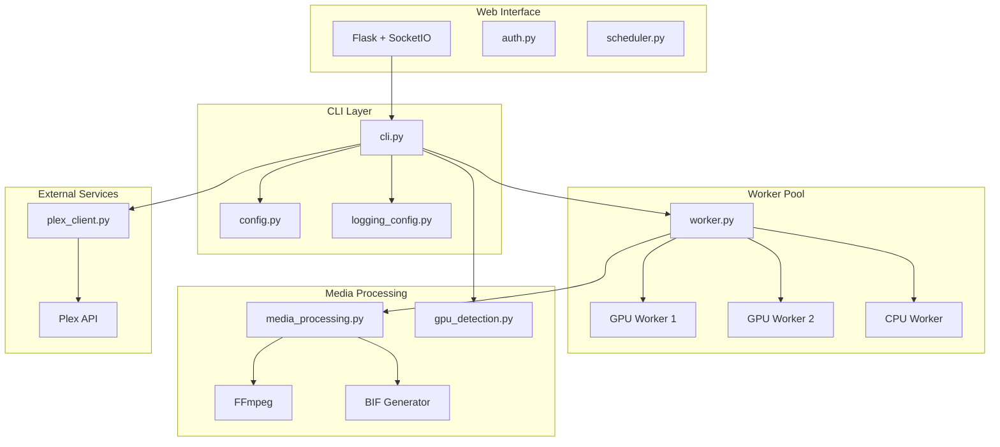

# Documentation

> Plex Generate Previews | [Main README](../README.md)

## Quick Links

| Doc | Description |
|-----|-------------|
| [Quick Start & Docker](quickstart.md) | Get running in 5 minutes, Docker Compose, networking |
| [Configuration](configuration.md) | All options + path mappings |
| [GPU Support](gpu-support.md) | NVIDIA, AMD, Intel acceleration |
| [Web Interface](web-interface.md) | Dashboard and scheduling |
| [FAQ](faq.md) | Questions + troubleshooting |

## Platform Guides

| Platform | Guide |
|----------|-------|
| Docker/Compose | [Quick Start & Docker](quickstart.md) |
| Unraid | [Unraid Guide](unraid.md) |

## Architecture

## API Reference

| Doc | Description |
|-----|-------------|
| [API Reference](API.md) | REST API documentation |

---

[Back to Main README](../README.md)
