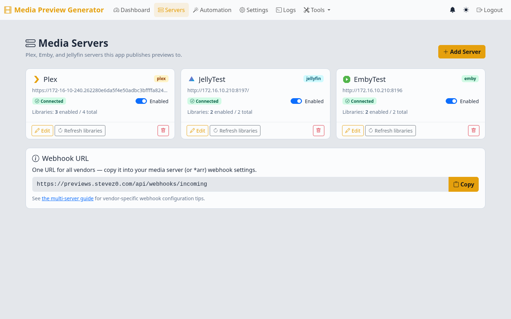

# Multi-Media-Server Support (Plex / Emby / Jellyfin)

> [Back to Docs](README.md)

The tool can drive any number of **Plex**, **Emby**, and **Jellyfin** servers
from a single instance. A new file is processed exactly once (one FFmpeg pass
on the GPU) and the resulting frames are published to **every** configured
server that owns it, in the format that server expects.



This page covers:

- [Why this exists](#why-this-exists)
- [How a webhook fires through the system](#how-a-webhook-fires-through-the-system)
- [Adding a server](#adding-a-server)
- [Per-vendor output formats](#per-vendor-output-formats)
- [Webhook configuration per vendor](#webhook-configuration-per-vendor)
- [Library ownership and retry semantics](#library-ownership-and-retry-semantics)
- [Smart dedup: skipping work that's already done](#smart-dedup-skipping-work-thats-already-done)
- [Slow-backoff retry queue](#slow-backoff-retry-queue)
- [Jellyfin trickplay extraction flag (the most common gotcha)](#jellyfin-trickplay-extraction-flag-the-most-common-gotcha)
- [BIF Viewer (multi-server)](#bif-viewer-multi-server)
- [Plex multi-server auto-discovery](#plex-multi-server-auto-discovery)
- [REST API summary](#rest-api-summary)

---

## Why this exists

Two reasons:

1. **Built-in generation has gaps.**
   - **Plex's** preview generation is single-threaded software (no GPU support).
   - **Emby's** Video Preview Thumbnail task is software-only ([forum](https://emby.media/community/index.php?/topic/145196-)) — no GPU support.
   - **Jellyfin** does support HW-accelerated trickplay generation, but it runs on the same machine as the server, so it competes with playback for CPU and GPU. (A historical issue with the legacy Intel i965 VAAPI driver on older Intel CPUs caused slowness for some users — that's been [resolved upstream](https://github.com/jellyfin/jellyfin/commit/db55d983f83f2b17e749a21ae35968fa0e83a915).)
2. **Multi-server users do redundant work.** If you run more than one
   server (a surprisingly common setup), each one generates its own
   previews from the same source files. This tool processes each file
   once and publishes the result everywhere — Plex BIF bundle, Emby
   sidecar BIF, Jellyfin trickplay tiles — from a single FFmpeg pass.

Where this tool helps most: offloading preview generation onto a
separate machine (a NAS, a dedicated GPU box, anything) so your
media server's CPU and GPU stay free for playback.

---

## How a webhook fires through the system

A single inbound URL, `POST /api/webhooks/incoming`, handles every source.

```
                  ┌────────────────────────────────────────────────────┐
  Plex multipart ─►                                                    │
  Emby JSON     ──►  classify_payload  ──►  match server by Server.uuid│
  Jellyfin JSON ──►   (vendor sniff)         / Server.Id / ServerId    │
  Sonarr/Radarr ──►                                                    │
  {"path": ...} ──►                                                    │
                  └────────────────────────────────────────────────────┘
                                               │
                                               ▼
                       resolve_item_to_remote_path  →  apply path_mappings
                                               │              ▼
                                               ▼      canonical local path
                                  process_canonical_path
                                               │
                                               ▼
                                  registry.find_owning_servers
                                               │
                                               ▼
                                 ONE FFmpeg pass → frame dir
                                               │
                       ┌───────────────────────┼───────────────────────┐
                       ▼                       ▼                       ▼
            Plex bundle BIF         Emby sidecar BIF        Jellyfin trickplay
            +scan trigger           +Library/Media/Updated  +Items/{id}/Refresh
```

Failures on one server don't take down the others — if Jellyfin's write fails the Emby sidecar still lands. The job log shows a per-server status row so you can see exactly what happened.

> [!NOTE]
> Two terms used throughout the rest of this doc:
> - **Dispatcher** — the routing engine inside the app that decides which servers a file goes to and in what order.
> - **Publisher** — the per-vendor writer that produces the on-disk output (Plex BIF, Emby BIF sidecar, Jellyfin trickplay tiles).

---

## Adding a server

Three vendors, three slightly different UX paths. All three terminate at
`POST /api/servers` with an auth token already in hand.

### Plex

Use the existing **Setup Wizard** at `/setup`. Plex OAuth via plex.tv
issues a token; nothing changes from the single-Plex flow. The migration
to `media_servers[]` happens automatically when the server first boots
the new code (the legacy `plex_*` keys are auto-translated by schema
migration v7).

### Emby

```
1. POST /api/servers/auth/emby/password
   { "url": "http://emby:8096", "username": "admin", "password": "..." }
   → returns { "access_token": "...", "user_id": "...", "server_id": "..." }

2. POST /api/servers
   { "type": "emby",
     "name": "Office Emby",
     "url": "http://emby:8096",
     "auth": {
       "method": "password",
       "access_token": "...",
       "user_id": "..."
     }
   }
   → returns the persisted entry with auth redacted; id is generated
```

API-key paste is also supported — skip step 1 and put `{"method": "api_key", "api_key": "..."}` straight into the auth block.

### Jellyfin (Quick Connect — recommended)

Quick Connect lets the user authorise this tool from inside their Jellyfin
web UI without ever giving us a password. **Note:** Quick Connect must be
enabled by the Jellyfin admin under *Server → Quick Connect*; it's off by
default.

```
1. POST /api/servers/auth/jellyfin/quick-connect/initiate
   { "url": "http://jellyfin:8096" }
   → returns { "code": "ABC123", "secret": "..." }

2. Display "code" to the user. They open Jellyfin → click their profile →
   Quick Connect → enter the code.

3. Poll until approved:
   POST /api/servers/auth/jellyfin/quick-connect/poll
   { "url": "http://jellyfin:8096", "secret": "..." }
   → { "authenticated": false }   (still pending)
   → { "authenticated": true }    (approved!)

4. Exchange the secret for a token:
   POST /api/servers/auth/jellyfin/quick-connect/exchange
   { "url": "http://jellyfin:8096", "secret": "..." }
   → { "access_token": "...", "user_id": "...", ... }

5. POST /api/servers with auth.method = "quick_connect" and the token.
```

### Jellyfin (username + password fallback)

Same shape as Emby — `POST /api/servers/auth/jellyfin/password`.

---

## Per-vendor output formats

Each server type expects a different on-disk layout. The app picks the right format automatically based on the server's type — you don't need to configure this.

| Vendor | Adapter | Output path |
|---|---|---|
| Plex | `plex_bundle` | Inside Plex's config folder: `Media/localhost/{hash}/.../index-sd.bif` |
| Emby | `emby_sidecar` | Next to the media file: `{basename}-{width}-{interval}.bif` |
| Jellyfin | `jellyfin_trickplay` | Next to the media file: `{basename}.trickplay/{width} - 10x10/{0,1,…}.jpg` (folders of 10×10 tile sheets) |

**Why Jellyfin's format is different.** Jellyfin (10.9 onwards) reads its own native JPG tile-grid format — *not* BIF. BIF would require users to install a third-party plugin (Jellyscrub) on their Jellyfin server. This app writes the native format, so no extra plugin is needed.

**Required Jellyfin library settings.** Three per-library settings need to be set so Jellyfin reads the trickplay folders this app writes — most importantly **Save trickplay images to media folders** = on. The Servers page in this app has a one-click **"Disable on this server"** button that flips all three correctly. See the in-app help for what each setting does.

**Optional Jellyfin plugin (recommended).** Installing the **Media Preview Bridge** plugin (one-click install from the Servers page) makes trickplay register *instantly* the moment this app finishes writing the tiles. Without the plugin, trickplay still appears — but only after Jellyfin's nightly trickplay sweep (default 3 AM) imports the files. See [Jellyfin Plugin](../jellyfin-plugin/README.md) for details.

---

## Webhook configuration per vendor

Set the same URL — `https://<this-tool>/api/webhooks/incoming?token=<webhook_secret>`
— in every vendor's webhook UI. The `token` query parameter is required for
Plex (Plex's webhook UI offers no header support); other vendors can use
the `X-Auth-Token` header instead.

The router auto-detects the vendor by payload shape and matches the source
server by the identifier embedded in every vendor's payload (Plex's
`Server.uuid`, Emby's `Server.Id`, Jellyfin's `ServerId`).

| Vendor | Webhook source |
|---|---|
| Plex | Server settings → Webhooks → Add webhook (Plex Pass required for outbound webhooks) |
| Emby | Server settings → Notifications → Webhooks (Emby Premiere required) |
| Jellyfin | Install **jellyfin-plugin-webhook**, configure under Plugins → Webhook |
| Sonarr / Radarr | Settings → Connect → +Webhook |

For Jellyfin, the plugin's stock `ItemAdded` template carries `ItemId` /
`ItemType` / `ServerId` but **not** the file path. The router calls back
to Jellyfin's API once to translate the id to a path. If you want to
skip that callback, configure the plugin's template body to be:

```handlebars
{
  "path": "{{Item.Path}}",
  "trigger": "file_added"
}
```

That bypasses the auto-detection altogether and treats the payload as
a path-first webhook.

### Per-server fallback URL

If two servers share a server identifier (rare; usually only happens
with cloned VMs) auto-detection can't disambiguate. Use the explicit
per-server URL: `POST /api/webhooks/server/<server_id>`.

---

## Library ownership and retry semantics

The dispatcher distinguishes three cases when a webhook fires:

| Case | Response |
|---|---|
| 1. Path is under no enabled library on this server | **Skip permanently** (status `no_owners`) |
| 2. Path is under an enabled library, but the server hasn't scanned the file yet | **Slow-backoff retry** queue (status `skipped_not_indexed`) |
| 3. Server is unreachable | Tight transport retry, eventual failure |

Ownership is decided from the cached `libraries[]` snapshot in each
server config — no per-file index. Toggle a library off via the
per-library `enabled` flag and the dispatcher will skip files in
that library cleanly with no retry storm.

---

## Smart dedup: skipping work that's already done

Two layers prevent the same file being processed twice:

1. **Short-term frame cache** — when a second webhook arrives for the same file shortly after the first (e.g. Sonarr and Plex both notify within minutes), the second one reuses the already-extracted JPGs instead of running FFmpeg again. The cache holds the most recent files for a configurable window (default 10 minutes). Concurrent webhooks for the same file (a "webhook storm") collapse into a single FFmpeg pass.

2. **Long-term sidecar tracking** — every published output gets a small companion file (`<file>.bif.meta`) that records the source file's last-modified time and size. On any later webhook, the app checks this companion file first — if every output already exists and the source hasn't changed, the whole pipeline is skipped. This handles "Sonarr fires immediately, then Plex's own webhook fires 30 minutes later for the same file."

   When the source file *does* change (a Sonarr quality upgrade swaps the file in place), the size/mtime comparison fails and FFmpeg re-runs automatically. To force regeneration manually (e.g. you changed the thumbnail quality), tick **Regenerate** when starting a job — that bypasses both layers.

Outputs created before this dedup system shipped don't have the sidecar — those get treated as fresh on the first post-upgrade webhook (no regeneration storm), then stamped on the next publish.

---

## Slow-backoff retry queue

When a publisher returns `SKIPPED_NOT_INDEXED` (most commonly Plex,
because publishing needs the bundle hash from `/library/metadata/{id}/tree`
which only exists *after* Plex has scanned the file), the dispatcher
schedules a retry instead of waiting for the user to fire a manual
re-run.

**Backoff schedule:** 30 s → 2 m → 5 m → 15 m → 60 m, then give up
and log. Total ~80 minutes — covers slow Plex full-scan windows
without becoming a runaway loop.

**Coalescing:** one pending retry per canonical path. Subsequent
webhooks for the same file while a retry is pending replace the
existing timer rather than piling up new ones.

**Reuses the dedup machinery:** retries call back into the same
dispatch code path, so the journal short-circuit, frame cache, and
per-publisher skip-if-exists all apply on retry. Retries are cheap
when the publish has already succeeded through some other path
(e.g. Plex's own webhook firing after its scan completes).

---

## Jellyfin trickplay extraction flag (the most common gotcha)

**Symptom:** every publish reports success, the trickplay tile sheets
land on disk in the right format at the right path, but Jellyfin's
web client shows no scrubbing thumbnails.

**Cause:** Jellyfin libraries default `EnableTrickplayImageExtraction`
to `false`. With that flag off, Jellyfin **ignores sidecar trickplay
files** in the media folder.

**Fix:** Connect to Jellyfin's web UI → *Dashboard → Libraries →
edit each library → enable "Trickplay image extraction"*.

Or use the **one-click auto-fix** built into this tool:

* Add Server wizard surfaces a `jellyfin_trickplay_disabled` warning
  in the connection-test response when libraries have it off.
* Servers list page shows a **"Fix trickplay"** button on every
  Jellyfin card. One click flips `EnableTrickplayImageExtraction` and
  `ExtractTrickplayImagesDuringLibraryScan` to `true` on every library
  via Jellyfin's `/Library/VirtualFolders/LibraryOptions` POST.
* Or call the API directly:
  ```
  POST /api/servers/<server_id>/jellyfin/fix-trickplay
  {
    "library_ids": ["..."]   # optional; omit to fix every library
  }
  ```

The button is idempotent — clicking on an already-correctly-configured
server is a no-op.

---

## BIF Viewer (multi-server)

The BIF Viewer at `/bif-viewer` lets you visually inspect a published
preview to see exactly what a player would render. It works for all
three vendors:

* **Plex / Emby**: parses the BIF file directly via `bif_reader`,
  renders frames as JPEG via `/api/bif/frame?path=…&index=…`.
* **Jellyfin**: parses the trickplay manifest, slices individual
  thumbnails out of the tile-grid sheets via Pillow, serves them via
  `/api/bif/trickplay/frame?server_id=…&sheets_dir=…&index=…&tile_width=10&tile_height=10`.

Use the server-picker dropdown at the top of the page to switch
between configured servers; the search results, frame list, and
thumbnail grid all refresh per server.

**Multi-server search endpoint:**
```
GET /api/bif/servers/<server_id>/search?q=<query>
```
Returns up to 15 results: `{title, type, year, media_file,
preview_path, preview_kind, preview_exists}`. `preview_kind` is
`"bif"` (Plex/Emby) or `"trickplay"` (Jellyfin) — the viewer branches
to the right renderer based on this.

---

## Plex multi-server auto-discovery

After Plex OAuth completes (one PIN sign-in via plex.tv), the wizard
calls `/api/v2/resources` and lists every server the account can
access. Tick **multiple** servers in the discovered list to add them
all in one go — each gets its own `media_servers[]` entry with the
same shared OAuth token but a distinct `server_identity` (Plex's
`clientIdentifier`) so the webhook router can disambiguate them.

The single-pick path still works for users who want to customise one
server before adding (set the config folder, adjust libraries). Tick
exactly one server to populate the wizard fields; tick multiple to
batch-add with shared defaults (you can edit each one from the
Servers page afterwards).

This reverses the older "single Plex only" limitation tracked in
issue #215.

---

## REST API summary

| Method | Endpoint | Description |
|---|---|---|
| GET | `/api/servers` | List all configured servers (auth redacted) |
| POST | `/api/servers` | Add a new server |
| GET | `/api/servers/<id>` | Get one server (auth redacted) |
| PUT/PATCH | `/api/servers/<id>` | Update fields (redacted auth values are kept) |
| DELETE | `/api/servers/<id>` | Remove a server |
| POST | `/api/servers/test-connection` | Test a candidate config without saving |
| POST | `/api/servers/<id>/refresh-libraries` | Re-fetch the server's library list |
| GET | `/api/servers/owners?path=...` | Diagnose which servers own a given path |
| GET | `/api/servers/<id>/output-status?path=...&item_id=...` | Whether publisher output files exist for a path on this server |
| POST | `/api/servers/auth/emby/password` | Username+password → Emby token |
| POST | `/api/servers/auth/jellyfin/password` | Username+password → Jellyfin token |
| POST | `/api/servers/auth/jellyfin/quick-connect/initiate` | Start Quick Connect ceremony |
| POST | `/api/servers/auth/jellyfin/quick-connect/poll` | Poll for approval |
| POST | `/api/servers/auth/jellyfin/quick-connect/exchange` | Exchange approved secret for token |
| POST | `/api/servers/<id>/jellyfin/fix-trickplay` | One-click flip of `EnableTrickplayImageExtraction` on a Jellyfin server's libraries |
| GET | `/api/bif/servers/<id>/search?q=...` | Multi-server BIF Viewer search; returns `preview_kind` per result |
| GET | `/api/bif/trickplay/info?server_id=...&path=...` | Parse a Jellyfin trickplay manifest + sheet metadata |
| GET | `/api/bif/trickplay/frame?server_id=...&sheets_dir=...&index=N&tile_width=10&tile_height=10` | Slice and serve a single thumbnail from a tile sheet |
| POST | `/api/webhooks/incoming` | Universal webhook with vendor auto-detection |
| POST | `/api/webhooks/server/<id>` | Per-server fallback webhook URL |

All endpoints (except `/api/webhooks/*` which use the webhook secret) accept
the same `X-Auth-Token` / `Authorization: Bearer` headers as the rest of
the REST API.
